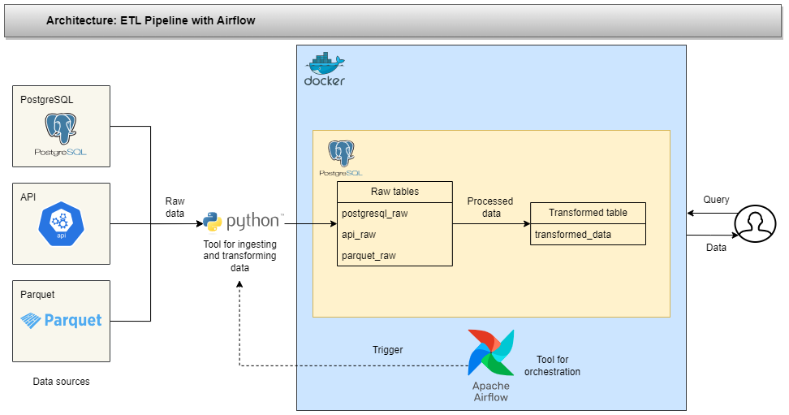
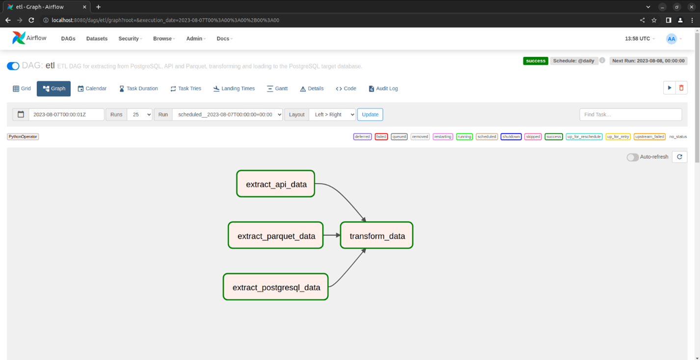

# ETL Pipeline with Airflow

This project contains a Python script that defines a Directed Acyclic Graph (DAG) for an ETL pipeline using Apache Airflow. The pipeline extracts data from a PostgreSQL database, an API, and a Parquet file, performs transformations on the extracted data, and loads the transformed data into a target PostgreSQL database.

## Pipeline architecture

## Dependencies

The project depends on the following Python libraries:

- os
- datetime
- pandas
- requests
- airflow
- dotenv
- sqlalchemy

## Configuration

Before running the script, you must create a `.env` file in the current directory containing the following environment variables necessary for setting up the connection to the PostgreSQL source and target databases, API, and Parquet file:

DB_SOURCE_BIX_USER=<database_user>
DB_SOURCE_BIX_PASSWORD=<database_password>
DB_SOURCE_BIX_HOST=<database_host>
DB_SOURCE_BIX_PORT=<database_port>
DB_SOURCE_BIX_DATABASE=<database_name>
DB_TARGET_BIX_USER=<target_database_user>
DB_TARGET_BIX_PASSWORD=<target_database_password>
DB_TARGET_BIX_HOST=<target_database_host>
DB_TARGET_BIX_PORT=<target_database_port>
DB_TARGET_BIX_DATABASE=<target_database_name>
API_SOURCE_BASE_URL=<api_base_url>
PARQUET_SOURCE_BASE_URL=<parquet_file_url>

Next, run the `docker-compose.yaml` file located in the `postgres` folder to start the PostgreSQL container. Proceed to use the Dockerfile in the `airflow` folder to create a custom image of Airflow. Following this, use the `docker-compose.yaml` files to start the Airflow container.

Then, to ensure all the containers are on the same network, run the `connect_network.sh` file. This will create a new network and connect the PostgreSQL and Airflow containers to it.

## DAG Structure

The pipeline contains the following tasks:

1. `extract_postgresql_data`: Extracts data from a PostgreSQL database.
2. `extract_api_data`: Extracts data from an API.
3. `extract_parquet_data`: Extracts data from a Parquet file.
4. `transform_data`: Transforms the extracted data and loads the transformed data into the target database.

The first three tasks (`extract_postgresql_data`, `extract_api_data`, `extract_parquet_data`) execute in parallel and, once completed, the data transformation task (`transform_data`) is executed.

## Execution

To run the script, you must have Apache Airflow installed and configured on your machine. Once you have Airflow configured, place the script in the Airflow DAGs folder and Airflow will automatically detect the script and schedule the DAG execution.

## Author

Rodrigo Carvalho
